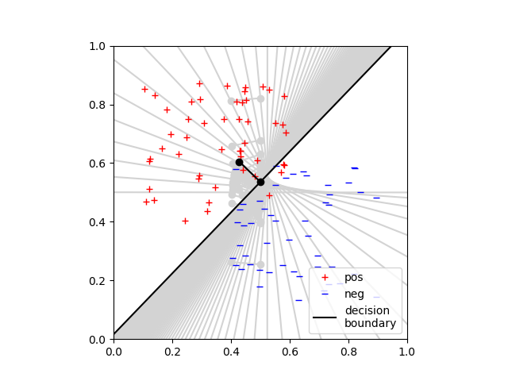
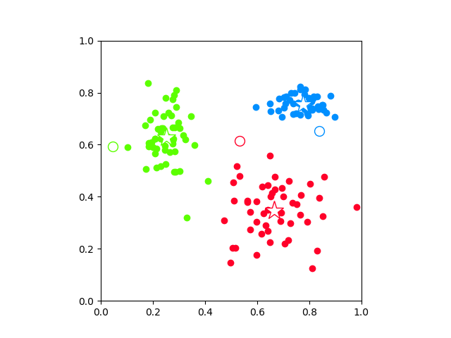
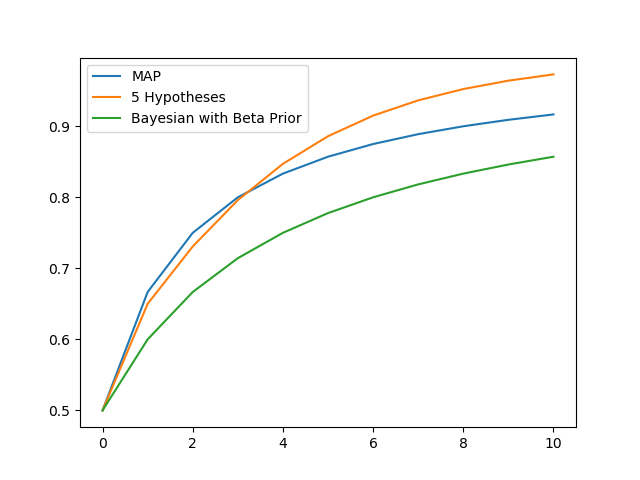

# cs383_MachineLearning

Homework assignment \#6 for Artificial Intelligence course. Includes programs for linear and logistic regression, k-means, and bayesian learning (also includes decision tree, but not yet implemented). All programs produce figures that can be located in `/figures`. Linear regression runs on set data, logistic regression operates on random data, k-means runs on random points with randomly initialized centroids.

## Running the Programs
### Running Linear Regression
Run Linear Regression with the following command:    
`>python linearRegression.py`   
Program approximates weight function through multiple iterations of gradient descent. Calculates the closed form solution through the utilization of the Moore-Penrose pseudoinverse. Output includes the difference between the approximate and analytic calculations and both weight vectors.

### Running Logistic Regression
Run Logistic Regression with the following command:    
`>python logisticRegression.py`   
Program generates a decision boundary between the two sets of points, gray lines represent boundaries generated during earlier iterations. Program reports the loss.    

Sample Graph:   
   

### Running kmean
Run kmeans with the following command:    
`>python kmeans.py`   
Program iteratively assigns vertices to clusters (through euclidean distance), reassigns the centroid locations as the center of all the points in cluster assignment. Produces graphs with two, three, and five centroids.

Sample Graph:   
   

### Running Bayesian Learning   
Run bayesian with the following command:    
`>python bayesian.py`   
Program generates graph with the probability of drawing a lime candy from a bag of unknown proportions of cherry and lime candies. Program operates on a list of draw. The index of the list is the draw number and the number stored in list is the number of limes drawn so far.

Finite set of hypotheses are as follows:
- Hypothesis 1: 0% chance of drawing lime candy. 
- Hypothesis 2: 25% chance of drawing lime candy.
- Hypothesis 3: 50% chance of drawing lime candy.
- Hypothesis 4: 75% chance of drawing lime candy.
- Hypothesis 5: 100% chance of drawing lime candy.

Generates probability using MAP hypothesis, MLE hypothesis, and utilizing infinite hypotheses with bayesian learning. The probability of drawing a lime at time `t` given that `t-1` limes have been drawn are plotted on the following graph:

